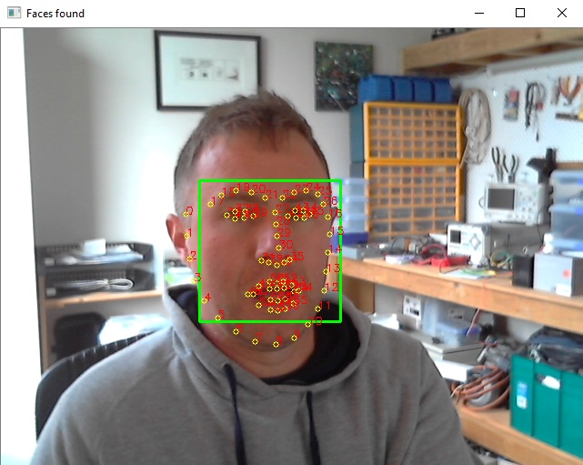

# Face Services

This repository contains a number of services related to the detection, tracking, identification, and manipulation
of faces.

Initially, services will be implemented that support the following tasks:

- Face localization - provides bounding boxes where faces are detected.
- Face landmark detection - provides a set of face keypoints based on a keypoint model.
- Face alignment - transforms face (rotate, translates, and scales) to a template landmark layout.
- Face identity - return a vector representing the faces identity mapped to N-dimensional manifold.

There are different techniques to solve these tasks, and the goal is provide multiple implementations so that
upstream tasks can swap implementations depending on availability, price, their impact on reputation and performance,
or other factors.

## Dependencies

Install Anaconda3, then open terminal with the Anaconda environment

```
conda create --name face-services python=3.6
conda activate face-services
pip install -r requirements.txt
```

You also need to download the following models from dlib:
http://dlib.net/files/dlib_face_recognition_resnet_model_v1.dat.bz2
http://dlib.net/files/shape_predictor_5_face_landmarks.dat.bz2
http://dlib.net/files/shape_predictor_68_face_landmarks.dat.bz2

## Webcam test



Eventually all services will call each other via some RPC mechanism, but while attempting to get each part working well
there is a `webcam_test.py` script.

This will activate your webcam and overlay outputs from each stage of processing, run with `python webcam_test.py`
from the conda `face-services` environment you created above.

## Launch Services

**TODO** Once individual steps work within the live webcam demo, they'll be wrapped up with grpc service definitions and
an automatic launcher launcher.